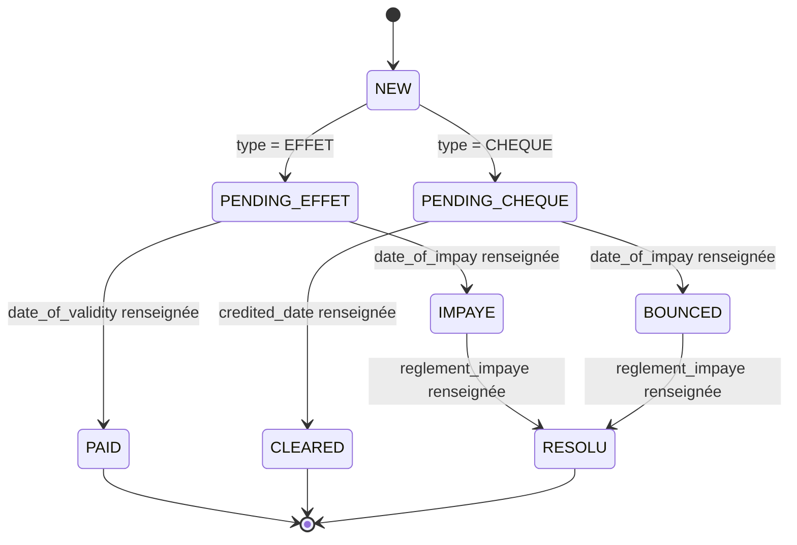
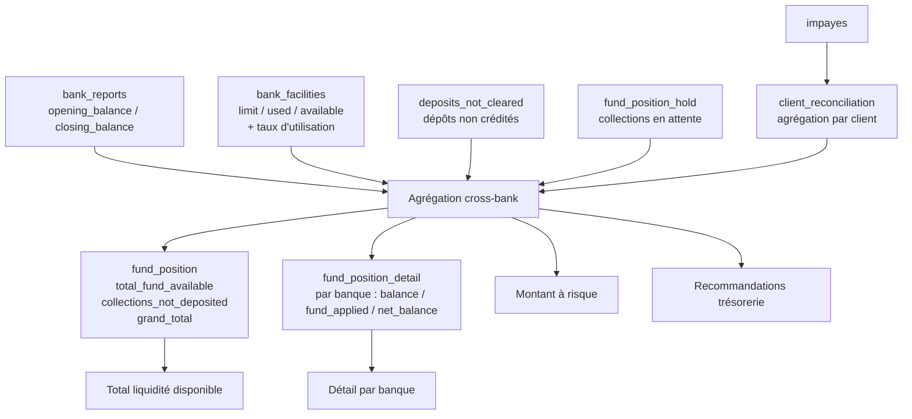
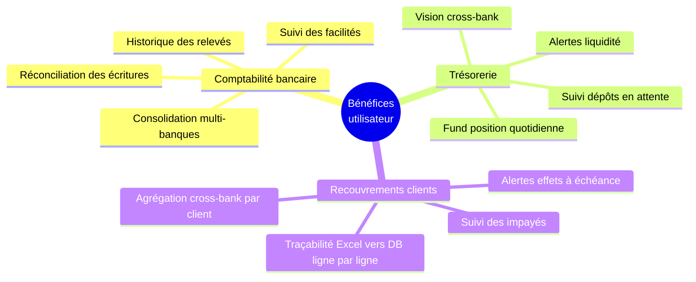

# Architecture fonctionnelle — sodatra / bank-sync-flow

> Document fonctionnel cible. Il décrit ce que l'application est **censée** faire pour les utilisateurs métier (DAF, trésorier, comptable, recouvrement). Il ne reflète pas l'état d'implémentation runtime ligne par ligne — chaque section précise explicitement ce qui est **fonctionnel aujourd'hui** et ce qui est **annoncé mais non implémenté**.

## Sommaire

1. [Inputs → Traitement → Outputs](#1-inputs--traitement--outputs)
2. [Cycle métier effet / chèque / impayé](#2-cycle-métier-effet--chèque--impayé)
3. [Trésorerie / Fund Position](#3-trésorerie--fund-position)
4. [Bénéfices utilisateur](#4-bénéfices-utilisateur)
5. [Périmètre fonctionnel cible](#5-périmètre-fonctionnel-cible)

---

## 1. Inputs → Traitement → Outputs

```mermaid
flowchart LR
  subgraph IN[Fichiers d'entrée]
    XL1[Excel COLLECTION REPORT]
    XL2[Excel FUND POSITION]
    XL3[Excel CLIENT RECONCILIATION]
    PDF1[Relevés BDK PDF/Excel]
    PDF2[Relevés ATB]
    PDF3[Relevés BICIS]
    PDF4[Relevés ORA]
    PDF5[Relevés SGS / SGBS]
    PDF6[Relevés BIS]
  end

  subgraph PIPE[Pipeline de traitement]
    DET[Détection type de fichier<br/>fileProcessingService<br/>enhancedFileProcessingService]
    EXT[Extraction<br/>excelProcessingService<br/>bankReportProcessingService<br/>bankReportSectionExtractor<br/>advancedExtractionService<br/>enhancedBDKExtractionService<br/>positionalExtractionService + pdfjs]
    MAP[Mapping<br/>excelMappingService<br/>regex EFFET vs CHEQUE]
    SYNC[Synchronisation intelligente<br/>intelligentSyncService<br/>contrainte unique_excel_traceability]
    DB[Persistance<br/>databaseService → Supabase]
  end

  subgraph TBL[Tables Supabase]
    T1[(bank_reports)]
    T2[(bank_facilities)]
    T3[(deposits_not_cleared)]
    T4[(impayes)]
    T5[(collection_report)]
    T6[(fund_position)]
    T7[(fund_position_detail)]
    T8[(fund_position_hold)]
    T9[(client_reconciliation)]
  end

  subgraph OUT[Sorties UI]
    O1[Dashboard consolidé multi-banques]
    O2[Vue consolidée cross-bank]
    O3[Alertes critiques]
    O4[Contrôle qualité]
    O5[Réconciliation]
    O6[Rapports bancaires]
  end

  IN --> DET --> EXT --> MAP --> SYNC --> DB --> TBL --> OUT
```

**Tables Supabase concernées** : `bank_reports`, `bank_facilities`, `deposits_not_cleared`, `impayes`, `collection_report`, `fund_position`, `fund_position_detail`, `fund_position_hold`, `client_reconciliation`.
**Services TypeScript impliqués** : `fileProcessingService`, `enhancedFileProcessingService`, `excelProcessingService`, `excelMappingService`, `bankReportProcessingService`, `bankReportSectionExtractor`, `advancedExtractionService`, `enhancedBDKExtractionService`, `positionalExtractionService`, `intelligentSyncService`, `databaseService`.
**Fonctionnel aujourd'hui** : import Excel `COLLECTION REPORT` complet et idempotent (648 lignes vérifiées, traçabilité `excel_filename` + `excel_source_row` + `unique_excel_traceability`), extraction BDK forcée en 7 colonnes positionnelles, sync intelligente avec distinction INSERT / UPDATE idempotent / enrichissement.
**Annoncé mais non implémenté** : la branche `bdk_analysis` de `enhancedFileProcessingService.processOrganizedFiles` n'est pas câblée bout en bout vers Supabase ; les parsers ATB / BICIS / ORA / SGS / BIS ne disposent pas de la même couverture positionnelle que BDK ; `FUND POSITION` et `CLIENT RECONCILIATION` côté Excel n'ont pas encore de pipeline d'import idempotent équivalent à `COLLECTION REPORT`.

---

## 2. Cycle métier effet / chèque / impayé

**Tables Supabase concernées** : `collection_report` (colonnes `processing_status`, `collection_type`, `effet_status`, `cheque_status`, `date_of_validity`, `date_of_impay`, `reglement_impaye`, `credited_date`, `effet_echeance_date`).
**Services TypeScript impliqués** : `excelMappingService` (détection EFFET vs CHEQUE par regex sur `facture_no` / `no_chq_bd` / `sg_or_fa_no`), `intelligentSyncService` (enrichissement et upsert), `databaseService`.
**Fonctionnel aujourd'hui** : extraction et persistance des dates clés (`date_of_validity`, `date_of_impay`, `reglement_impaye`) ; classification EFFET / CHEQUE à partir des colonnes Excel ; mise à jour idempotente des lignes existantes.
**Annoncé mais non implémenté** : moteur de transition d'état automatique (le `processing_status` reste majoritairement à `NEW`) ; alertes d'échéance effet (`effet_echeance_date`) non câblées dans `AlertsManager` ; recalcul automatique du statut consolidé lors d'un ré-règlement n'est pas encore en place.

---

## 3. Trésorerie / Fund Position

**Tables Supabase concernées** : `bank_reports`, `bank_facilities`, `deposits_not_cleared`, `fund_position_hold`, `impayes`, `client_reconciliation`, `fund_position`, `fund_position_detail`.
**Services TypeScript impliqués** : `dashboardMetricsService`, `crossBankAnalysisService`, `bankingUniversalService`, `databaseService`, et côté UI `ConsolidatedDashboard`, `ConsolidatedBankView`, `ConsolidatedMetrics`.
**Fonctionnel aujourd'hui** : schéma complet en base (toutes les tables existent avec RLS), agrégations de base sur `collection_report` et `bank_reports`, vue consolidée multi-banques quand les données sont importées.
**Annoncé mais non implémenté** : le moteur de recommandations trésorerie ; le calcul cross-bank du montant à risque ; la page `BankingDashboard.tsx` utilise un `mockData` (ligne 59) au lieu d'interroger Supabase ; la page `BankingReports.tsx` n'est pas branchée sur les vraies données ; le trigger d'agrégation `impayes → client_reconciliation` n'est pas garanti côté DB.

---

## 4. Bénéfices utilisateur

**Pages UI cibles** : `ConsolidatedDashboard`, `BankingDashboard`, `BankingReports`, `Reconciliation`, `Alerts`, `QualityControl`, `FileUpload`, `FileUploadBulk`.
**Services TypeScript impliqués** : `dashboardMetricsService`, `crossBankAnalysisService`, `qualityControlEngine`, `intelligentSyncService`, `specializedMatchingService`.
**Fonctionnel aujourd'hui** : Upload + sync Excel `COLLECTION REPORT` opérationnels avec compteurs UX (Ajoutées réellement / Mises à jour idempotentes / Enrichies / Ignorées) ; affichage consolidé partiel sur `ConsolidatedDashboard` ; traçabilité Excel→DB intégrale via `excel_filename`, `excel_source_row`, `unique_excel_traceability`.
**Annoncé mais non implémenté** : `BankingDashboard` et `BankingReports` reposent encore sur des données mockées (`mockData` ligne 59 de `BankingDashboard.tsx`) ; les alertes d'effets à échéance ne sont pas générées automatiquement ; la consolidation cross-bank par client (vue 360°) n'est pas finalisée côté UI.

---

## 5. Périmètre fonctionnel cible

### 5.1 Comptabilité bancaire
Le comptable doit pouvoir charger un relevé bancaire (BDK, ATB, BICIS, ORA, SGS/SGBS, BIS) au format PDF ou Excel et obtenir, sans saisie manuelle, le solde d'ouverture et de clôture, les facilités utilisées et disponibles, les dépôts non crédités et les impayés détectés. L'application doit consolider l'ensemble des banques sur une même journée pour produire un état comptable unifié, conserver l'historique daté pour audit, et signaler les écarts entre les relevés et les écritures internes via le module de réconciliation.

### 5.2 Trésorerie
Le trésorier doit disposer chaque matin d'une `fund_position` consolidée : liquidité totale disponible toutes banques confondues, détail par banque (balance, fund_applied, net_balance), collections en attente de crédit, dépôts non encore validés, et montant total à risque (impayés + chèques en suspens). L'objectif cible inclut des alertes automatiques sur les seuils de liquidité, le suivi des effets arrivant à échéance, et des recommandations d'arbitrage entre banques.

### 5.3 Recouvrements clients
Le responsable recouvrement doit suivre, ligne par ligne et facture par facture, l'état de chaque collection : effet ou chèque, en attente, payé, impayé, ou ré-réglé. L'agrégation par client (`client_reconciliation`) doit donner une vue 360° des impayés cross-bank, alimentée automatiquement depuis les relevés bancaires et les imports Excel `COLLECTION REPORT`. La traçabilité doit permettre, pour toute ligne en base, de remonter au fichier source (`excel_filename`), à la ligne d'origine (`excel_source_row`) et à sa clé unique (`unique_excel_traceability`), garantissant l'auditabilité complète du recouvrement.